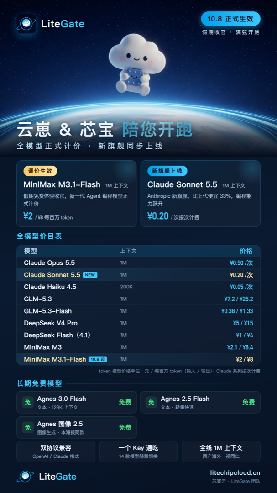

<div align="center">



# LiteGate Cli

**一条命令，把 Claude Code / Codex / ZCode / MiniMax Code 等 AI 编程工具全部接上 LiteGate**

[](https://www.litechipcloud.cn)
[](https://www.litechipcloud.cn)
[](https://www.litechipcloud.cn)
[](https://www.litechipcloud.cn)
[](LICENSE)

[English](#english) | 中文

</div>

---

> [!IMPORTANT]
> 本仓库是 **LiteGate 官方 CLI 与资源中心**（MIT 开源）。LiteGate 网关本身为商业服务，本仓库不包含其源码。

## ✨ 这是什么

**LiteGate** 是一站式大模型 API 网关：一个 Key 通吃 Claude / GLM / DeepSeek / MiniMax / Qwen 等 14 款模型，OpenAI 与 Claude 双协议兼容，长期免费模型，全线 1M 上下文。

**LiteGate Cli** 解决最后一个痛点：每款 AI 编程工具的自定义模型配置格式都不一样——

```bash
npx @litechipcloud/litegate init
```

一条命令：检测本机工具 → 粘贴 Key → 自动写入配置（增量模式不碰已有配置，自动备份可回滚）。

## ⚡ 快速开始

```bash
# 零安装直接用
npx @litechipcloud/litegate init

# 或全局安装
npm install -g @litechipcloud/litegate
litegate init
```

`init` 会：检测本机 AI 编程工具 → 让你选择要接入的工具 → 粘贴 [LiteGate Key](https://www.litechipcloud.cn)（控制台「词元页」创建）→ 自动配置并校验。

<details>
<summary>🔧 手动配置示例（CLI 做的事，透明可查）</summary>

**Claude Code**（`~/.claude/settings.json`）：

```json
{ "env": {
    "ANTHROPIC_BASE_URL": "https://www.litechipcloud.cn",
    "ANTHROPIC_AUTH_TOKEN": "sk-lcc-你的Key"
} }
```

**Codex CLI**（`~/.codex/config.toml`）：

```toml
model_provider = "litegate"
model = "minimax-m3.1-flash"

[model_providers.litegate]
name = "LiteGate"
base_url = "https://www.litechipcloud.cn/v1"
env_key = "LITEGATE_API_KEY"
wire_api = "chat"
```

</details>

## 📊 模型与定价（2026-10-08 起）

| 模型 | 上下文 | 价格 |
|---|---|---|
| Claude Opus 5.5 | 1M | ¥0.50 /次 |
| **Claude Sonnet 5.5** 🆕 | 1M | ¥0.20 /次 |
| Claude Haiku 4.5 | 200K | ¥0.05 /次 |
| GLM-5.3 | 1M | ¥7.2 / ¥25.2 每百万 |
| GLM-5.3-Flash | 1M | ¥0.38 / ¥1.33 每百万 |
| DeepSeek V4 Pro | 1M | ¥5 / ¥15 每百万 |
| DeepSeek Flash（4.1） | 1M | ¥1 / ¥4 每百万 |
| MiniMax M3 | 1M | ¥2.1 / ¥8.4 每百万 |
| **MiniMax M3.1-Flash** | 1M | ¥2 / ¥8 每百万 |
| Agnes 3.0 / 2.5 Flash · Agnes 图像 2.5 | 128K | **长期免费** |

> Claude 系列按次计费；其余按 token（输入/输出）。价格可能调整，以控制台为准。

## 🛟 命令

| 命令 | 功能 |
|---|---|
| `litegate init` | 交互式接入（检测→选择→配置） |
| `litegate status` | 查看本机 AI 工具与接入状态 |
| `litegate models` | 实时模型与价格列表 |
| `litegate switch <model>` | 一键切换默认模型 |
| `litegate rollback` | 一键回滚全部修改 |
| `litegate doctor` | 环境诊断 |

## 🔧 支持的 AI 编程工具

| 工具 | 状态 |
|---|---|
| Claude Code | ✅ 支持 |
| Codex CLI | ✅ 支持 |
| ZCode | ✅ 支持（深度集成） |
| MiniMax Code | ✅ 支持 |
| Continue | ✅ 支持 |
| Trae / WorkBuddy | 🔄 适配中 |
| Cursor | ⚠️ 需 Cursor Pro 订阅（自定义 API Key 为 Pro 功能） |

> CLI 只配置**你本机已安装**的工具——支持矩阵是兼容性清单，不是安装清单。

## 💡 为什么用 LiteGate Cli

- **批量接入**：一条命令，本机全部 AI 编程工具一次性接上 LiteGate——不用挨个工具手工改配置
- **模型列表实时同步**：新模型上线自动进入你的工具，无需手动填模型 ID 和价格
- **官方深度集成**：Key 创建深链、接入后自动烟测、ZCode 等国产工具深度支持
- **安全**：增量模式不动既有配置、自动备份、一键回滚、全开源可审计

## 🌐 English

**LiteGate** is an all-in-one LLM API gateway: one API key for Claude, GLM, DeepSeek, MiniMax, Qwen and 14 models in total — OpenAI & Anthropic compatible, permanently free models, 1M context across the lineup.

**LiteGate Cli** wires all your AI coding agents (Claude Code, Codex, ZCode, MiniMax Code and more) to LiteGate in one command:

```bash
npx @litechipcloud/litegate init
```

See the Chinese documentation above for full details — the configuration examples are language-agnostic.

## 🔗 Links

- [控制台 / Console](https://www.litechipcloud.cn)
- [LiteGate 团队](https://www.litechipcloud.cn)

<div align="center">

**加入用户群，和云崽&芯宝一起开跑**


</div>

---

## License

[MIT](LICENSE)
