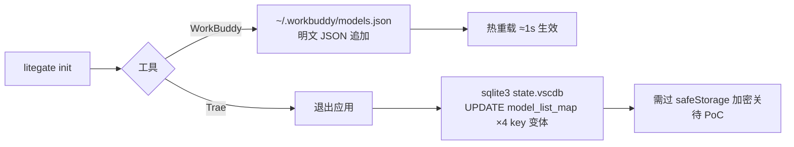

# AI 编程工具配置存储调研：Trae 与 WorkBuddy

> LiteGate Cli 适配器路线图调研（2026-10-08，macOS 实机深查）。目的：让 CLI 能程序化地把两款工具接入自定义 OpenAI 兼容网关。

## 结论一览

| 工具 | 配置位置 | 格式 | Key 存储 | 程序化写入 |
|---|---|---|---|---|
| **Trae**（TRAE SOLO CN） | `~/Library/Application Support/TRAE SOLO CN/User/globalStorage/state.vscdb` | SQLite（VSCode globalState，表 `ItemTable`） | Electron `safeStorage` **加密** | ⚠️ 结构可行，Key 加密写入待 PoC |
| **WorkBuddy**（腾讯，CodeBuddy 内核） | `~/.workbuddy/models.json` | 明文 JSON，官方支持，热重载 ≈1s | 明文 | ✅ 最容易，schema 双形态待实测 |



## Trae（字节，Electron，实装形态为 TRAE SOLO CN）

- **注意**：`~/.trae/` 只有 computer-use/skills，**不是**模型配置；数据在 `TRAE SOLO CN` 目录（无经典 `Trae*` 目录）。
- **模型列表 key**（按登录账号 uid 前缀，冒号/下划线两种变体共 4 个 key 需同步写）：
  - `{uid}:AI.agent.model.model_list_map`（主 key，代码常量为裸字符串 `AI.agent.model.model_list_map`）
  - `{uid}_AI.agent.model.model_list_map`（旧变体）
  - 选中态：`{uid}:AI.agent.model.session_selected_model`（modelId 形如 `solo_agent_lite_<下标>_<provider>_<name>`）
- **value 结构**：JSON 对象，按 agent 类型分组（`solo_agent_lite` / `assistant`），条目含 `name/display_name/provider/base_url/ak/sk/is_preset/config_source` 等。
- **自定义 provider 枚举**（提取自 app bundle `@byted-icube/ai-modules-chat`）：`custom_openai_compatible`、`custom_anthropic_compatible`、`custom_responses_compatible` —— OpenAI 兼容网关**可以接**（实机已有经 UI 添加的 LiteGate 条目在用，`base_url` 形如 `https://<host>/v1/messages`）。
- **坑**：`ak`/`sk` 为 safeStorage 密文（macOS 由 Keychain 支撑）。CLI 直接写明文，Trae 解密会得到乱码，大概率鉴权失败（是否容忍明文未验证）。
- **次要风险**：预置模型列表来自服务端，启动时可能拉取覆盖 → 只追加 custom 条目、保留原结构。

### V0.2 PoC 步骤（待执行）
1. 要求 Trae 退出（检测进程）。
2. 备份 state.vscdb；UPDATE 全部 4 个 key 变体（追加 custom 条目，明文 ak）。
3. 启动 Trae 实测该模型能否对话：通 → 明文可容忍；不通 → 降级方案 = 引导用户 UI 粘贴一次 key（或复用已加密旧值只改 base_url）。

## WorkBuddy（腾讯）

- **应用已卸载的场景**：`~/.workbuddy/` 数据目录与配置独立保留；残留 `editor_sdk` 进程与本调研无关。
- **`~/.workbuddy/models.json`** 就是官方自定义模型配置（应用日志证实 `CustomModelsProductProvider userConfigPath=` 指向它），官方文档明确"仅保存在本地，不上传云端"，保存后 ≈1s 热重载。
- **schema 双形态**：实机 app 写出的是裸数组 `[]`；第三方教程为 `{"models":[...]}` 包装对象 → 写入前需实测本版本偏好（建议先以数组形态写一条）。

```json
[{
  "id": "claude-sonnet-5-5",          // 传给 API 的 model 参数（必填）
  "name": "LiteGate Sonnet 5.5",      // 下拉显示名（必填）
  "vendor": "LiteGate",               // 厂商标识（必填）
  "apiKey": "sk-lcc-…",               // 明文（必填）
  "url": "https://www.litechipcloud.cn/v1/chat/completions",  // 完整地址（必填）
  "supportsToolCall": true,
  "supportsImages": false
}]
```

### V0.2 PoC 步骤（待执行）
1. 装 WorkBuddy（或找到可用环境）→ 先用 UI 添加一条，观察 app 回写的真实 schema。
2. CLI 按回写 schema 合并追加 LiteGate 全量 chat 模型 → 重启/等待热重载 → 实测对话。

## 附：本机其它 AI IDE 踪迹（未深挖）

VS Code、CodeBuddy（扩展）、Qoder（痕迹）、Cursor（dotdir）、Codeium、iFlow、Qwen Code、豆包（痕迹）均有目录踪迹，均为 V0.3+ 候选。

## 变更记录

| 日期 | 版本 | 说明 |
|---|---|---|
| 2026-10-08 | v0.1 | 首版调研；V0.1 CLI 对两款工具 detect 已按真实路径升级，configure 待 PoC 后实装 |
